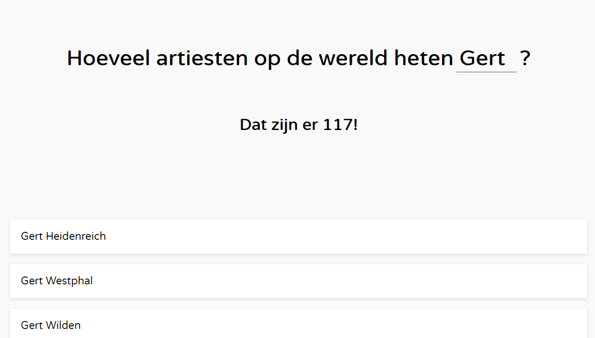
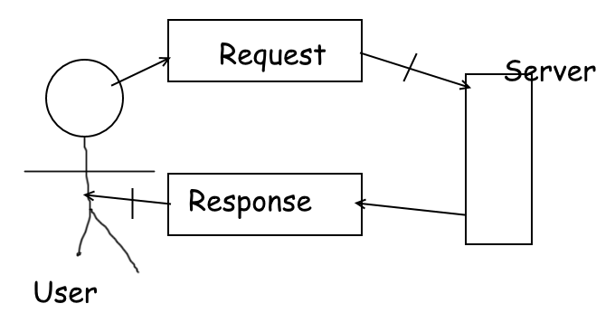
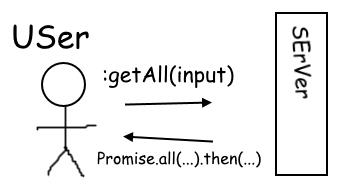

## Live demo

https://webapp-from-scratch.netlify.com/

Notice: Requests take SUUUUUPER long, have patience please :)

## What does this app do?
This app lets you find out how many artists in the world have a name similar to your query.

## Welke actoren zitten er in jouw applicatie? (actor diagram)
There's a user and there's the server.

## What API do I use, what are its limits? (rate limit)
I'm using the MusicBrainz API, which allows about 50 requests per second if you "legitimise" your requests. Sadly I cannot prevent throttling so I can only send about 1 request per second :(
Also, it only gives back at most 25 items per request, while there can be thousands of items, so you have to send a lot of requests, which will in turn throttle your requests. Bad API!

## How dows the application interaction flow? (interaction diagram)

## What design patterns and best practises did I use?
- I tried to be as functional as possible (No "no-side-effects" nonsense though).
- Use only promises and async/await for asynchronous code.
- I tried to not use the Promise constructor antipattern wherever I could.

## What would I like to add (feature wishlist / backlog)
Requests have to be sent super slowly, therefore waiting for all requests to be resolved takes ages. I would like to find a way to "stream" the resolvements and process every resolve appropriately (or just rebuild the entire app to recursively call a function and give back responses on-the-fly).